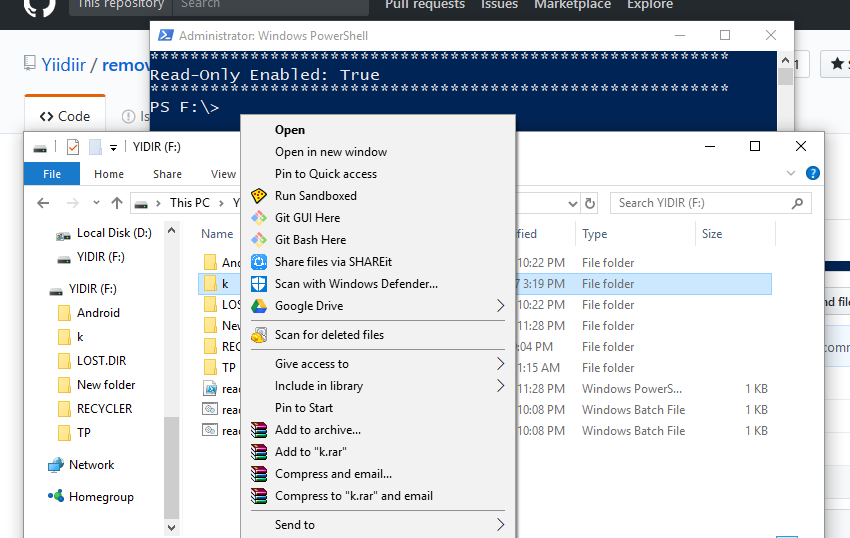

# removable-read-only
A small script to automate toggling read-only mode independently of partiton letter or drive 'rank'.


## Getting Started

```cd``` to your removable drive
```
PS X:> cd X
```
```git clone``` this repository 

```
PS X:> git clone https://github.com/Yiidiir/removable-read-only.git
```

```cd``` to removable-read-only/examples

```
PS X:> cd removable-read-only/examples
```


## Usage
**PowerShell must have elevated privileges (Administrator)** *to access Set-disk -IsReadOnly*

```
PS X:> .\read_only.ps1
usage: .\read_only.ps1 [-write] (BOOLEAN)
```
Set removable drive to read-only mode
```
required argument:
  -write            Allow writing in drive (must be explicitly declared)
```

### Input

The only existing input is a boolean declaring whenever writing should be allowed or not:

```
PS X:> .\read_only.ps1 -write 0
```


### Output

By default there will be no output. 

```
PS X:\>
```

If you want to see a an output message, uncomment lines: 8,12,3 from ```read_only.ps1```

```
**********************************************************
Read-Only Enabled: True
**********************************************************
PS F:\>
```
### TODO:
* Auto-exit console
* Add Help parameter 
* Add Output parameter
* Support Linux
* Self-elevating permission in PowerShell 


Licensed under the [MIT License](https://github.com/Yiidiir/removable-read-only/blob/master/LICENSE)
